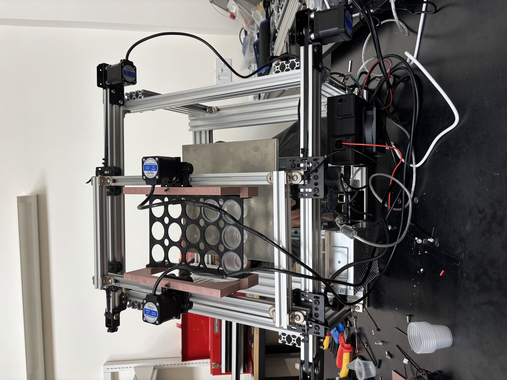

# Automated Gantry-Based Sample Weighing System

> A fully functional laboratory automation system that replaces a 6-step manual weighing workflow with a single operator action — load a tray and walk away.


*Assembled gantry system deployed in soil lab*

---

## Overview

Manual sample weighing in a soil lab is tedious, error-prone, and slow. An operator had to weigh each sample individually, read the scale, and manually key the result into a spreadsheet — six discrete steps per sample, repeated 40+ times per batch.

This project eliminates that bottleneck entirely. The operator loads a tray of samples, starts a run, and the machine traverses each position, weighs the sample, and logs the result automatically. No manual data entry. No transcription errors. No fatigue-related mistakes.

**Projected impact:**
- 🕐 **85% reduction** in technician time per batch
- ⚡ **40+ samples in ~20 minutes** vs. 2+ hours manually
- ✅ **Zero manual data entry** — all results logged programmatically

---

## Demo


*System automatically positioning and weighing samples during a live run*

---

## System Architecture

```
┌─────────────────────────────────────────────────┐
│                 Operator Interface               │
│         (load tray → start run → done)          │
└─────────────────────┬───────────────────────────┘
                      │
┌─────────────────────▼───────────────────────────┐
│              Raspberry Pi 5 (Host)               │
│   Klipper firmware host + Moonraker API server  │
│         Python control scripts (OOP)            │
└──────────┬──────────────────────┬───────────────┘
           │  UART/USB            │ Serial (scale)
┌──────────▼──────────┐   ┌──────▼──────────────┐
│   SKR 3 EZ Board    │   │  Laboratory Scale    │
│  (Motion Control)   │   │  (RS-232 / USB)      │
└──────────┬──────────┘   └─────────────────────┘
           │ Step/Dir signals
┌──────────▼──────────┐
│   Stepper Drivers   │
│  (X, Y, Z axes)     │
└──────────┬──────────┘
           │
┌──────────▼──────────┐
│  Aluminum Extrusion │
│  Gantry Frame       │
│  (CoreXY or Cartesian)│
└─────────────────────┘
```

---

## Hardware Stack

| Component | Role |
|-----------|------|
| **Raspberry Pi 5** | Main compute — runs Klipper, Moonraker, and Python control scripts |
| **BTT SKR 3 EZ** | 32-bit motion control board; handles stepper driver communication and G-code execution |
| **Stepper Drivers** | Translate step/direction signals to motor current (TMC-series or equivalent) |
| **NEMA Stepper Motors** | Precise, repeatable positioning across X/Y/Z axes |
| **Aluminum Extrusion Frame** | Rigid, modular gantry structure built from 2020/2040 V-slot extrusion |
| **Laboratory Scale** | Readout captured serially by the Pi; eliminates manual reading |

---

## Software Stack

| Layer | Technology |
|-------|-----------|
| **Firmware** | [Klipper](https://www.klipper3d.org/) — runs on the SKR board, exposes G-code interface |
| **API Server** | [Moonraker](https://moonraker.readthedocs.io/) — REST API for sending commands to Klipper from Python |
| **Control Scripts** | Python 3 — OOP-structured scripts for sequencing sample positions, triggering weighing, and logging results |

> **Note:** The original Python scripts are no longer available, but the architecture followed standard OOP patterns: a `GantryController` class wrapping Moonraker API calls, a `Scale` class handling serial communication, and a `SampleRun` class orchestrating a full batch sequence.

---

## How It Works

1. **Operator loads** a tray of labeled samples onto the platform
2. **Operator starts** a run via the control script (single command)
3. The system reads the **sample manifest** (positions and IDs)
4. For each sample, the gantry **moves to position** using G-code sent via the Moonraker API
5. The script **queries the scale** over serial, captures the stable reading
6. The result is **appended to a log file** with timestamp, sample ID, and weight
7. The gantry moves to the next position — repeat until batch complete

---

## Key Engineering Decisions

**Why Klipper + Moonraker instead of custom firmware?**
Klipper is battle-tested motion firmware with excellent stepper calibration support. Moonraker exposes it as a REST API, which made it trivial to drive from Python without writing low-level firmware code — a strong separation of concerns for a lab context.

**Why a gantry vs. a turntable or conveyor?**
A Cartesian gantry scales easily to arbitrary tray layouts. Sample positions are just (X, Y) coordinates in a config file — adding new tray formats requires no mechanical changes.

**Why aluminum extrusion?**
V-slot extrusion is modular, dimensionally consistent, and widely used in precision motion systems. It allowed rapid iteration on the frame geometry without custom fabrication.

---

## Skills Demonstrated

- **Embedded systems:** Raspberry Pi 5, UART/USB communication, serial interfacing with lab instruments
- **Motion control:** Stepper motor configuration, driver tuning, G-code, Klipper firmware
- **Mechanical design:** Aluminum extrusion gantry construction, linear motion systems
- **Software architecture:** Python OOP, REST API integration (Moonraker), serial I/O
- **Lab automation:** Stakeholder requirements gathering, Agile iteration, process documentation
- **Systems integration:** Bridging hardware (motors, scale) with software (Python scripts, firmware API)

---

## Development Process

Requirements were gathered directly from lab technicians — the people who perform the manual workflow daily. Iteration followed an **Agile framework**: short build-test cycles, frequent feedback from operators, and incremental scope expansion (starting with single-axis positioning, then full gantry, then scale integration, then data logging).

---

## Future Work

- [ ] Barcode scanner integration for automatic sample ID capture
- [ ] Web dashboard (via Moonraker's existing web interface) for run monitoring
- [ ] ROS 2 port — reframe as a ROS node for portability and community tooling
- [ ] Vision-based sample detection to verify tray loading before a run starts
- [ ] Closed-loop error handling (retry on unstable scale reading, alert on missed position)

---

## Repository Structure

```
.
├── README.md
└── images/
    ├── system_overview.jpg
    └── weighing_in_action.jpg
```

---

## Background

Built as an internal tool for a soil testing laboratory. The system was designed, fabricated, and programmed by one engineer, working directly with lab staff to define requirements and validate performance.
